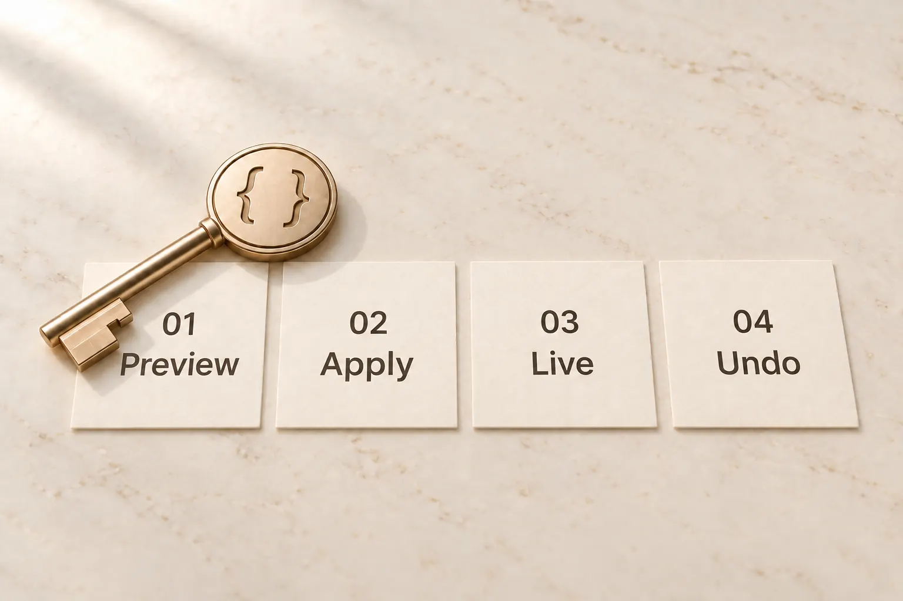
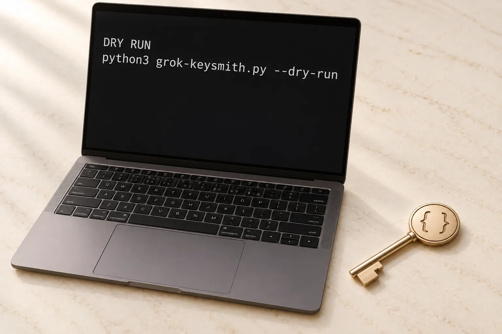

<!-- markdownlint-disable MD013 MD033 MD041 -->

<div align="center">

<picture>
  <source media="(prefers-color-scheme: dark)" srcset="docs/assets/readme/grok-keysmith-hero-dark.webp" />
  <source media="(prefers-color-scheme: light)" srcset="docs/assets/readme/grok-keysmith-hero-light.webp" />
  
</picture>

<p>
  <a href="https://github.com/Jia-Ethan/grok-keysmith/stargazers"></a>
  <a href="https://github.com/Jia-Ethan/grok-keysmith/releases/latest"></a>
  
  
</p>

<p>
  <a href="README.md">简体中文</a> ·
  <a href="#english">English</a> ·
  <a href="docs/reference.md">Guide</a> ·
  <a href="LICENSE">License</a>
</p>

<h1>grok-keysmith</h1>

<p>Install a reversible instruction onto Grok Build. Preview first, write only after you confirm.</p>

</div>

## English

Keysmith installs instructions onto local AI coding tools: preview, apply, verify, and undo.

`grok-keysmith` is the installer for **Grok Build**. After it is on, new conversations follow the instruction. The app itself is not modified, and accounts and keys are never read.

> [!IMPORTANT]
> This changes **later new conversations** in Grok. Commands show the plan first and write only when you confirm. Open a new session after installing.

## How it works

<p align="center">
  <picture>
    <source media="(prefers-color-scheme: dark)" srcset="docs/assets/readme/project-architecture-en-dark.webp" />
    <source media="(prefers-color-scheme: light)" srcset="docs/assets/readme/project-architecture-en-light.webp" />
    
  </picture>
</p>

1. **Preview first.** Nothing is written until you confirm.
2. **Apply when ready.** The instruction is installed locally. The app stays official.
3. **Start a new conversation.** A fresh session is required.
4. **Remove it whenever you want.** Review the plan, then restore how it was.

<p align="center">
  <picture>
    <source media="(prefers-color-scheme: dark)" srcset="docs/assets/readme/grok-keysmith-preview-dark.webp" />
    <source media="(prefers-color-scheme: light)" srcset="docs/assets/readme/grok-keysmith-preview-light.webp" />
    
  </picture>
</p>

## Which Keysmith to use

| You use | Installer | How to start |
| --- | --- | --- |
| [Codex](https://github.com/Jia-Ethan/codex-keysmith) | codex-keysmith | Stable package |
| [Claude Code](https://github.com/Jia-Ethan/claude-keysmith) | claude-keysmith | Source |
| **Grok Build** | **grok-keysmith** | Stable package |
| [ZCode](https://github.com/Jia-Ethan/zcode-keysmith) | zcode-keysmith | Source |

One installer per tool. An unsigned desktop build is also available.

## Results

<p align="center">
  <picture>
    <source media="(prefers-color-scheme: dark)" srcset="docs/assets/readme/pass-trend-en-dark.webp" />
    <source media="(prefers-color-scheme: light)" srcset="docs/assets/readme/pass-trend-en-light.webp" />
    
  </picture>
</p>

On the same model and the same 22 prompts, complete artifacts rose from 14 to 19.

## Get started

Grok Build must already have been run once. Prefer the stable zip.

```bash
curl -LO https://github.com/Jia-Ethan/grok-keysmith/releases/download/v0.6.1/grok-keysmith-v0.6.1.zip
unzip grok-keysmith-v0.6.1.zip
cd grok-keysmith-v0.6.1
python3 grok-keysmith.py --dry-run
python3 grok-keysmith.py --yes
```

Then open a new Grok session. You can also hand the [agent-install notes](docs/agent-install.md) to an AI assistant. Details live in the [guide](docs/reference.md).

## Undo

```bash
python3 grok-keysmith.py --uninstall
python3 grok-keysmith.py --uninstall --yes
```

Review the plan, then confirm.

## Platform

macOS, Windows, and Linux. Python 3.8+.

## Docs

- [Guide](docs/reference.md)
- [Agent install](docs/agent-install.md)
- [Security](SECURITY.md)

## Series

- [codex-keysmith](https://github.com/Jia-Ethan/codex-keysmith) — for Codex
- [claude-keysmith](https://github.com/Jia-Ethan/claude-keysmith) — for Claude Code
- [grok-keysmith](https://github.com/Jia-Ethan/grok-keysmith) — for Grok Build
- [zcode-keysmith](https://github.com/Jia-Ethan/zcode-keysmith) — for ZCode

Feedback: [GitHub Discussions](https://github.com/Jia-Ethan/grok-keysmith/discussions) · Community: [LINUX DO](https://linux.do)

## Star History

<p align="center">
  <a href="https://star-history.com/#Jia-Ethan/grok-keysmith&Date">
    <picture>
      <source media="(prefers-color-scheme: dark)" srcset="https://api.star-history.com/svg?repos=Jia-Ethan/grok-keysmith&type=Date&theme=dark">
      
    </picture>
  </a>
</p>
